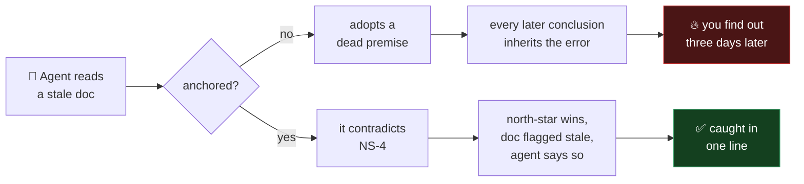
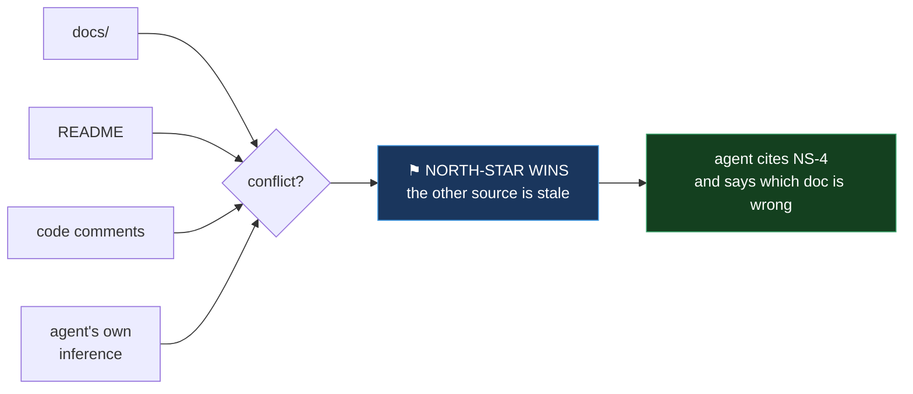
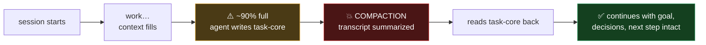
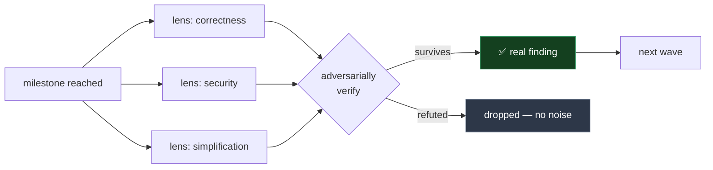
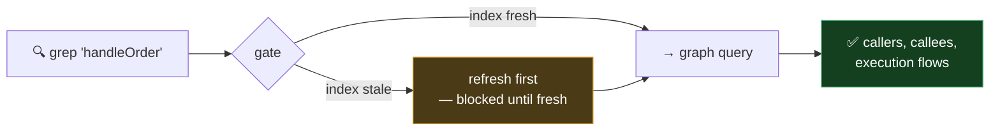

<div align="center">

# bearing

**An intel layer for AI coding agents.**

Cognitive routines that keep an agent anchored to what your project actually is — across long sessions, context compaction, and months of accumulated documentation.

[](https://nodejs.org/)
[](LICENSE)

Works with **Claude Code**, **Cursor**, **Zed**, and **Codex**.

</div>

---

## The problem

Your tests catch code that breaks. **Nothing catches an agent that has drifted about what the code *means*.**

It reads a doc you abandoned in March. It re-proposes the feature you already measured and killed — because the refutation lives in a changelog it never opened. Two hundred thousand tokens in, it's optimising for a goal you never set.

Every answer stays fluent. Confident. Subtly wrong.

**And it never fails loudly.** A drifted agent doesn't crash — it writes a convincing paragraph, you nod, and you find out three days later that the premise was dead on arrival.



That failure has a name — **losing your bearings**. `bearing` gives an agent fixed points it can't drift away from, and makes the drift *visible in one line* when it happens.

## What you get

Four independent modules. Pick any combination; each works alone.

| Module | What it does |
|---|---|
| **North-stars** | Numbered, authoritative claims about what your project *is* — invariants, exact term meanings, settled decisions, ideas already rejected and why. **Outranks every other doc**, re-injected as the session runs. → *No more re-litigating decisions you made months ago.* |
| **Task-core** | A dense save-state of the *current task*, written **before** compaction drops the detail and read back on recovery. → *A four-hour task doesn't forget its own goal at hour three.* |
| **Microscope** | Milestone review through several independent lenses, adversarially verified, iterated in waves. → *Catches what a single confident pass always misses.* |
| **GitNexus** *(optional)* | Hard gates that redirect symbol greps to a real code knowledge graph and demand impact analysis before edits. → *The agent stops guessing at your architecture.* Needs the GitNexus MCP server. |

## Install

```bash
npx bearing
```

The interactive installer explains each module and lets you choose. Or be explicit:

```bash
npx bearing install . --runtime claude --features northstars,taskcore
npx bearing install /path/to/repo --runtime all --features all
```

`--runtime` — `claude` · `cursor` · `zed` · `codex` · `all`
`--features` — `northstars` · `taskcore` · `microscope` · `gitnexus` · `all`

Then restart your IDE and open a new agent chat.

### Module support by runtime

Enforcement needs tool-interception hooks, and only some runtimes expose them. Everything still *works* everywhere — the difference is whether a rule is **enforced** or merely **instructed**.

| | Claude Code | Cursor | Zed | Codex |
|---|:---:|:---:|:---:|:---:|
| **North-stars** — loaded as authority | ✅ | ✅ | ✅ | ✅ |
| **North-stars** — re-anchored mid-session | ✅ | — | — | — |
| **Task-core** — survives compaction | ✅ | — | — | — |
| **Microscope** — deep review routine | ✅ | ✅ | ✅ | — |
| **GitNexus** — graph contract | ✅ | ✅ | ✅ | ✅ |
| **GitNexus** — hard gates (grep redirected) | ✅ | ✅ | — | — |

**Claude Code gets everything.** Elsewhere the north-stars are read at session start but not continuously reinforced — and that re-injection is what stops an anchor decaying across a long session.

## How each module works

### ⚑ North-stars — one source of truth that outranks the rest

Docs rot. Comments lie. An agent's own inference fills the gaps. North-stars are the **fixed point** that settles every conflict — and the agent has to *cite* them.



Write them as numbered claims a conclusion could actually **violate**:

```markdown
- **NS-1** — The backtest stop model MUST match the live order's stop model.
              If they differ the scoreboard is invalid.
- **NS-4** — Win-rate is NEVER a ranker. Only net expectancy is a profitability claim.
- **NS-9** — REJECTED: averaging into a losing position. Measured: adds fill only on the
              weaker cases (adverse selection). Don't re-propose without new evidence.
```

*"Be careful with risk"* can't be violated, so it can't catch anything. **Falsifiable or it's decoration.**

If the agent can't cite one for a load-bearing claim, it says so — that's your drift alarm. It can propose changes, but never edit them silently: an anchor that drift can rewrite isn't an anchor.

> Built for a real codebase where 81 documents had come to contradict each other on live production parameters — including a `CLAUDE.md` that routed every agent to a design doc marked superseded.

### 💾 Task-core — the task survives the summary

Long sessions get **compacted**: the transcript is summarized and thrown away. Detail dies there — the goal, the decisions, the thing you told it *not* to do at hour one.



Written **before** the summary lands, not after — by then the detail is already gone.

### 🔬 Microscope — many lenses, adversarially checked

One review pass finds what one reviewer thinks to look for. Microscope runs several independent lenses, then **tries to refute its own findings** before reporting them.



Findings that can't survive an attack never reach you.

### 🕸 GitNexus — the agent stops guessing *(optional)*

Grepping a symbol gives you 40 text matches and no structure. The graph knows what actually calls what.



The only module needing an external dependency — and the only one that can *block* a tool rather than advise.

## Requirements

- Node.js ≥ 22.9.0
- A git repository
- macOS, Linux, Windows, or WSL
- *(GitNexus module only)* the [GitNexus](https://github.com/abhigyanpatwari/GitNexus) MCP server

## Commands

```bash
npx bearing install <repo> [--runtime ...] [--features ...]
npx bearing-update <repo>       # pull in a newer bearing, keep your selection
npx bearing-uninstall <repo>
```

## Documentation

[Quickstart](docs/QUICKSTART.md) · [Skills](docs/SKILLS.md) · [Architecture](docs/ARCHITECTURE.md) · [Zed + local models](docs/ZED.md)

## License

ISC
