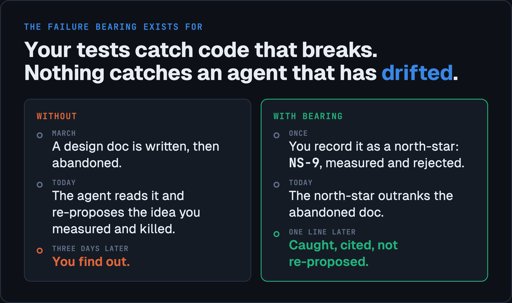
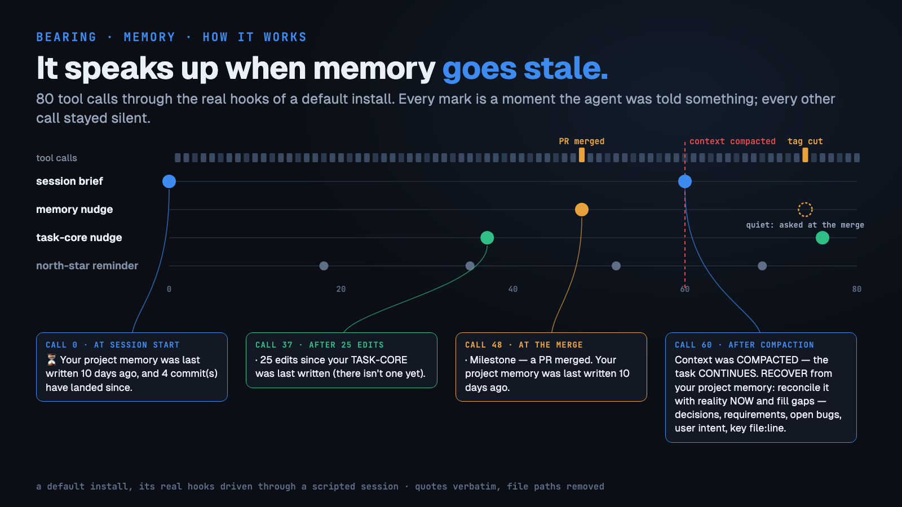
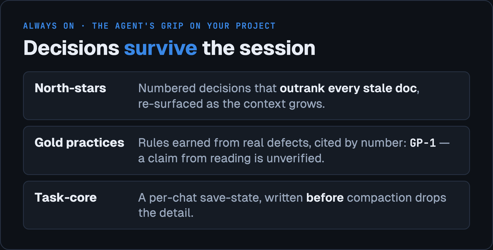
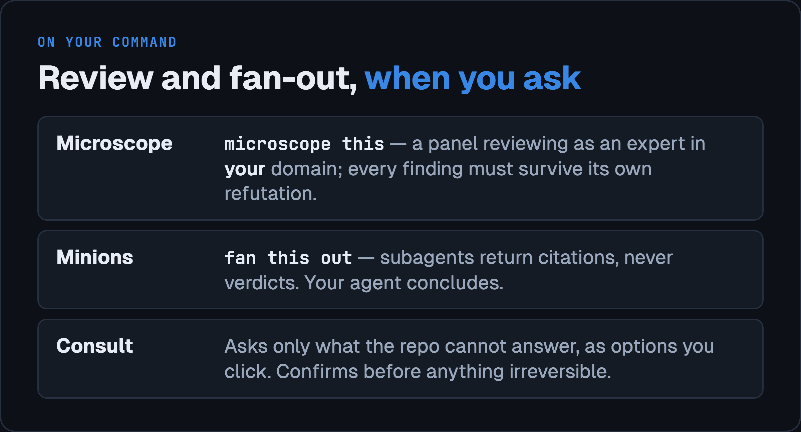
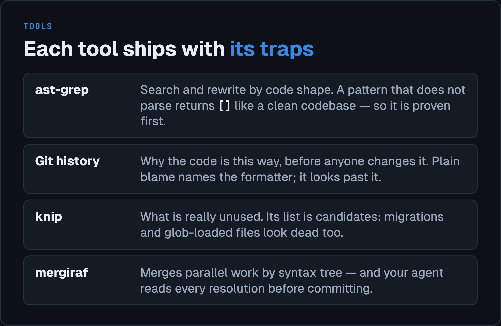
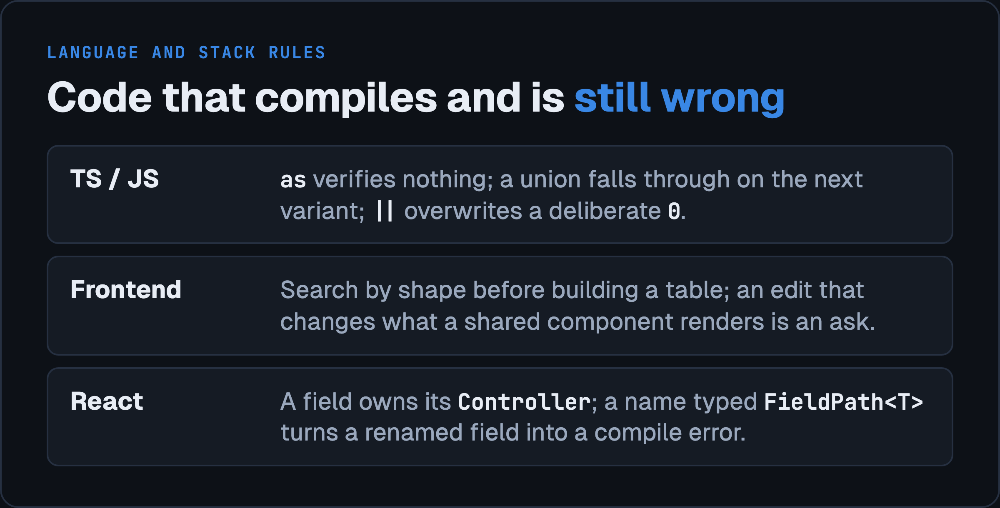
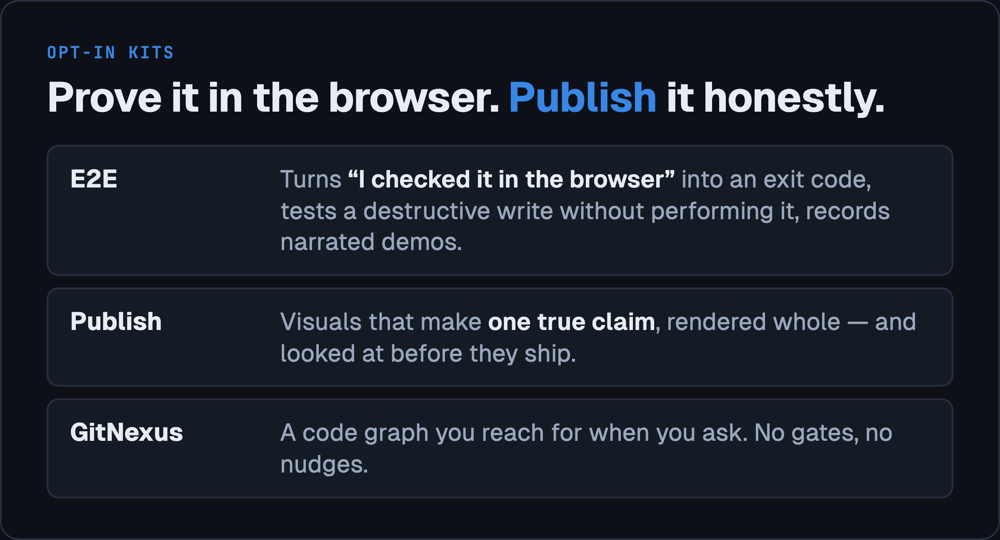
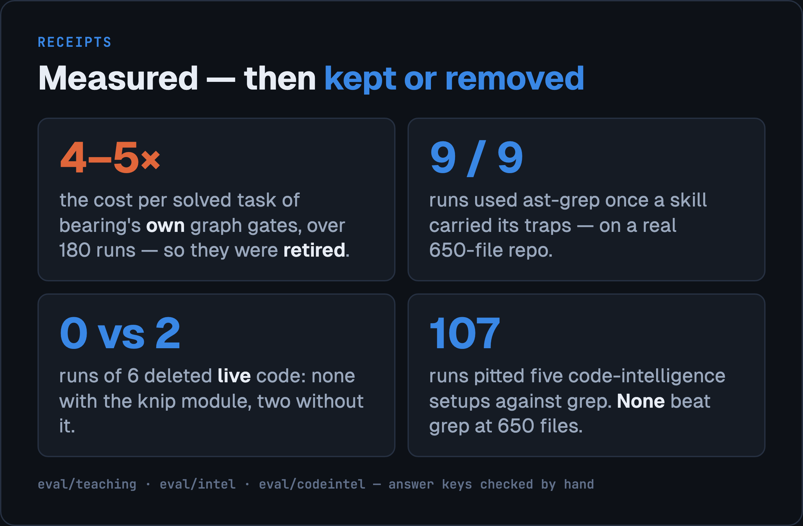
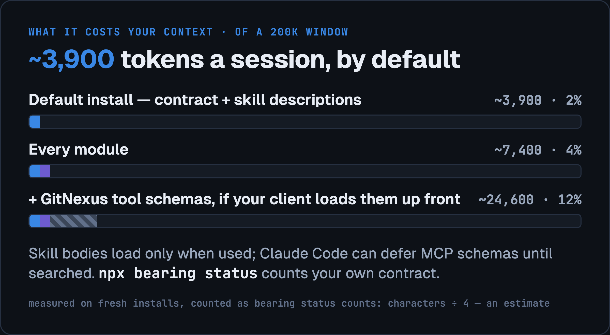

<div align="center">


# bearing

**Your tests catch code that breaks. Nothing catches an agent that has drifted about what the code *means*.**

A toolbelt for developers who already work with coding agents: north-stars that outrank stale docs,
memory the agent keeps true, a task-core that survives compaction, ast-grep with the traps that make
it lie, review and fan-out when you ask for them. **You decide when.**

[](https://www.npmjs.com/package/bearing)
[](https://www.npmjs.com/package/bearing)
[](https://nodejs.org/)
[](LICENSE)
[](https://github.com/ReidenXerx/bearing)

**Claude Code** · **Zed** · **Codex**

```bash
npx bearing
```

**[duduphudu.app/bearing](https://duduphudu.app/bearing/)** — what it does, what it costs, and where it fails




A drifted agent doesn't crash. It reads a doc you abandoned in March, re-proposes the feature you
already measured and killed, and writes a convincing paragraph about it. You nod. You find out three
days later. That failure has a name — **losing your bearings**.



**And it keeps its own memory true.** The next session starts from memory, not from this transcript —
so the agent is asked to maintain it at the four moments it goes stale, and writes it itself.
[How, and the knobs](https://github.com/ReidenXerx/bearing/blob/main/docs/modules/memory.md)

## What you get

Sixteen modules, each independent: pick any combination. Seven are on by default; the rest you add.



**Always on, and the reason it exists.** [North-stars](https://github.com/ReidenXerx/bearing/blob/main/docs/modules/northstars.md) · [gold practices](https://github.com/ReidenXerx/bearing/blob/main/docs/modules/northstars.md) · [task-core](https://github.com/ReidenXerx/bearing/blob/main/docs/modules/taskcore.md)



**Nothing here starts on its own.** [Microscope](https://github.com/ReidenXerx/bearing/blob/main/docs/modules/microscope.md) · [minions](https://github.com/ReidenXerx/bearing/blob/main/docs/modules/minions.md) (gathering, and applying a decided change) · [consult](https://github.com/ReidenXerx/bearing/blob/main/docs/modules/consult.md)



**ast-grep is on by default; the other three are opt-in.** None adds anything to your `package.json`. [ast-grep](https://github.com/ReidenXerx/bearing/blob/main/docs/modules/astgrep.md) · [Git history](https://github.com/ReidenXerx/bearing/blob/main/docs/modules/history.md) · [knip](https://github.com/ReidenXerx/bearing/blob/main/docs/modules/knip.md) · [mergiraf](https://github.com/ReidenXerx/bearing/blob/main/docs/modules/mergiraf.md)



**Opt-in, for the stack you have.** [TypeScript / JavaScript](https://github.com/ReidenXerx/bearing/blob/main/docs/modules/tsjs.md) · [Frontend](https://github.com/ReidenXerx/bearing/blob/main/docs/modules/frontend.md) · [React](https://github.com/ReidenXerx/bearing/blob/main/docs/modules/react.md)



**Each one asks before it installs anything heavier.** [E2E harness](https://github.com/ReidenXerx/bearing/blob/main/docs/modules/e2e.md) (Playwright) · [Publish](https://github.com/ReidenXerx/bearing/blob/main/docs/modules/publish.md) (Playwright) · [GitNexus](https://github.com/ReidenXerx/bearing/blob/main/docs/modules/gitnexus.md) (its CLI and MCP server)

**What it won't do:** block a tool, push a workflow on you, or decide when you review, fan out or
reach for the graph. It speaks up unasked only to keep the agent's grip on your project — a brief at
session start, the north-stars again as the context grows, a nudge when unsaved work piles up before a
compaction, a memory check after a merge or a release — and `npx bearing status` lists each one with
the knob that turns it off.

## Measured, not asserted



Every number traces to a report with a hand-checked answer key:
[gates](https://github.com/ReidenXerx/bearing/blob/main/eval/teaching/REPORT.md) · [ast-grep](https://github.com/ReidenXerx/bearing/blob/main/eval/intel/REPORT-REAL.md) ·
[knip](https://github.com/ReidenXerx/bearing/blob/main/eval/intel/REPORT-TOOLS.md) · [code intelligence](https://github.com/ReidenXerx/bearing/blob/main/eval/codeintel/REPORT.md).
Nothing leaves your repo; there is no telemetry.



Skill bodies load only when used. [The numbers, and the claim this page used to make and dropped](https://github.com/ReidenXerx/bearing/blob/main/docs/context-cost.md).

## Install

```bash
npx bearing                                    # interactive — explains each module
npx bearing install . --runtime claude --features northstars,taskcore
npx bearing install . --stealth                # a repo that isn't yours: git status stays clean
```

`--runtime` `claude` · `zed` · `codex` · `all`  ·  `--features` `northstars` · `goldpractices` · `taskcore` · `microscope` · `consult` · `minions` · `tsjs` · `frontend` · `react` · `astgrep` · `history` · `knip` · `mergiraf` · `publish` · `gitnexus` · `e2e` · `all`

`npx bearing status` says what bearing does in a repo: what is always loaded, each thing that speaks
up unasked with its knob, and the skills you can invoke. `npx bearing doctor` says whether an install
is still healthy and the command that fixes each problem. Stealth, Prettier, several sessions in one
repo: [install details](https://github.com/ReidenXerx/bearing/blob/main/docs/install.md).

Then restart your IDE. The moments a module speaks up need tool-interception hooks, and **only
Claude Code** exposes them:

Then restart your IDE. The moments a module speaks up need tool-interception hooks, and **only
Claude Code** exposes them:

| | Claude Code | Zed | Codex |
|---|:---:|:---:|:---:|
| North-stars — loaded as authority | ✅ | ✅ | ✅ |
| North-stars — re-anchored mid-session | ✅ | — | — |
| Gold practices — cited as authority | ✅ | ✅ | ✅ |
| Task-core — survives compaction | ✅ | — | — |
| Microscope — domain-expert review | on ask | on ask | — |
| Consult — ask vs decide | ✅ | ✅ | — |
| Minions — anchored fan-out | on ask | — | — |
| TypeScript/JavaScript — traps that compile | ✅ | ✅ | ✅ |
| Frontend — structure and blast radius | ✅ | ✅ | ✅ |
| React — what the types do not catch | ✅ | ✅ | ✅ |
| ast-grep — search and rewrite by shape | ✅ | ✅ | ✅ |
| Git history — why code is this way | ✅ | ✅ | ✅ |
| knip — what is really unused | ✅ | ✅ | ✅ |
| mergiraf — merge by syntax tree, reviewed | ✅ | ✅ | ✅ |
| Publish — visuals with one true claim | ✅ | ✅ | ✅ |
| GitNexus — the graph, only when you ask | on ask | on ask | — |
| E2E — browser verification | ✅ | ✅ | ✅ |

✅ means it fires without being asked; *on ask* means it never does, by design, and answers when you ask. A `—` is not always absence: the **task-core** skill and its
contract section install on every runtime, so you can invoke it by name — what Claude Code adds is
the nudge that fires it unprompted. **Minions** need Claude Code's subagents and are not present at all
where the column says `—`. Microscope, minions and GitNexus fire only when you ask, on any runtime that
has their skill.

## Commands

```bash
npx bearing install <repo> [--runtime ...] [--features ...] [--mcp http|stdio|<port>] [--stealth] [--prettierignore]
npx bearing update <repo>       # keeps your module + transport choices
npx bearing uninstall <repo>    # restores what it overwrote
npx bearing status [<repo>]     # what is loaded, what speaks up unasked + its knob, the skills
npx bearing doctor [<repo>]     # is the install healthy; --all <folder> for every install
```

With the GitNexus module: `bearing:refresh` · `bearing:health` · `bearing:verify` · `bearing:ci` · `bearing:token-benchmark`

**Requirements:** Node ≥ 22.9.0 · a git repo · macOS, Linux, Windows or WSL · *(GitNexus module only)* the GitNexus MCP server.

[Quickstart](https://github.com/ReidenXerx/bearing/blob/main/docs/QUICKSTART.md) · [Skills](https://github.com/ReidenXerx/bearing/blob/main/docs/SKILLS.md) · [Architecture](https://github.com/ReidenXerx/bearing/blob/main/docs/ARCHITECTURE.md) · [Zed + local models](https://github.com/ReidenXerx/bearing/blob/main/docs/ZED.md) · [Changelog](https://github.com/ReidenXerx/bearing/blob/main/CHANGELOG.md) · [Releases](https://github.com/ReidenXerx/bearing/releases)

## License

ISC
